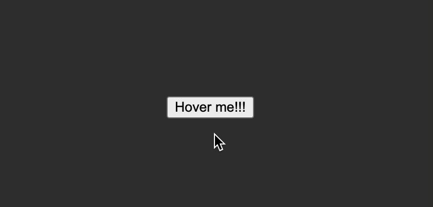
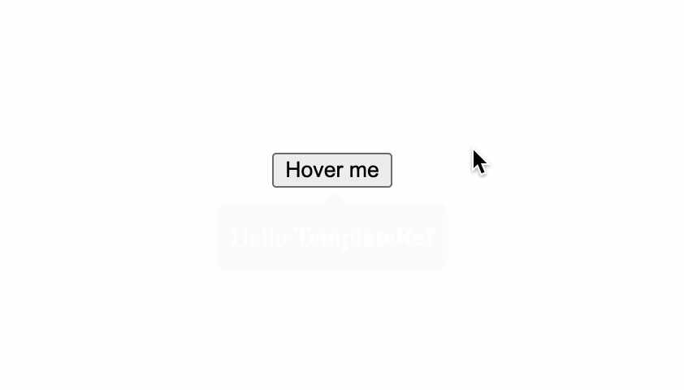

# angular-tooltip [](https://app.circleci.com/pipelines/github/babybeet/angular-tooltip?branch=main)

Easily show tooltips programmatically and/or declaratively in Angular.

## Table of contents

<!-- toc -->

- [Angular compatibility](#angular-compatibility)
- [Installation](#installation)
- [Accessibility](#accessibility)
- [Tooltip placement](#tooltip-placement)
- [Using `TooltipDirective`](#using-tooltipdirective)
  - [Supported input bindings](#supported-input-bindings)
    - [`bbbTooltip`](#bbbtooltip)
    - [`bbbTooltipPlacement`](#bbbtooltipplacement)
    - [`bbbTooltipTheme`](#bbbtooltiptheme)
  - [Code example with `TooltipDirective`](#code-example-with-tooltipdirective)
  - [Result](#result)
- [Using `TooltipService`](#using-tooltipservice)
  - [`TooltipService`](#tooltipservice)
  - [`TooltipConfiguration`](#tooltipconfiguration)
  - [`Placement`](#placement)
  - [`Theme`](#theme)
- [Example Usage](#example-usage)
  - [Code example with a string content](#code-example-with-a-string-content)
    - [Result](#result-1)
  - [Code example with a `TemplateRef` content](#code-example-with-a-templateref-content)
    - [Result](#result-2)

<!-- tocstop -->

## Angular compatibility

| This library | Angular |
| ------------ | ------- |
| 1.x.x        | 16 - 17 |

## Installation

- `npm`
  ```
  npm i -S @babybeet/angular-tooltip
  ```
- `pnpm`
  ```
  pnpm i -S @babybeet/angular-tooltip
  ```
- `yarn`

  ```
  yarn add @babybeet/angular-tooltip
  ```

## Accessibility

The tooltip component that gets created handles wiring up `aria-describedby` attribute for accessability between the tooltip trigger and the tooltip content, so it's completely transparent to you as the API user.

## Tooltip placement

There are 2 supported placement values: `vertical` and `horizontal`. `vertical` will either place the tooltip at the bottom or top of the anchor element depending on which side has enough space for the tooltip to not be cutoff. Similarly, `horizontal` will either place the tooltip at the right or left of the anchor element depending on which side has enough space for the tooltip to not be cutoff. By default, `vertical` is used and the tooltip is placed at the bottom of the anchor.

## Using `TooltipDirective`

Because `TooltipDirective` is a standalone directive, you must import it into your `@NgModule` or your standalone component before using it.

`TooltipDirective` can be applied to any elements in your templates to trigger a tooltip on hover/keyboard navigation (when users focus on the tooltip trigger by pressing the tab key)/long presses on mobile devices.

### Supported input bindings

#### `bbbTooltip`

Sets the tooltip message to show.

#### `bbbTooltipPlacement`

Sets the position where the tooltip is placed. Valid values are `vertical` and `horizontal`. `vertical` is the default if not specified.

#### `bbbTooltipTheme`

Sets the theme. Must be either `dark` or `light`. `dark` is the default if not provided.

### Code example with `TooltipDirective`

```ts
@Component({
  imports: [TooltipDirective],
  selector: 'your-component',
  standalone: true,
  template: `
        <button
            bbbTooltip='Hello World'
            <!-- if "bbbTooltipPlacement" is not specified, "vertical" is assumed -->
            bbbTooltipPlacement='vertical'
            <!-- if "bbbTooltipTheme" is not specified, "dark" is assumed -->
            bbbTooltipTheme='dark'>
            Hover me
        </button>
    `
})
export class YourComponent {}
```

### Result

| Theme |                                                                       |
| ----- | --------------------------------------------------------------------- |
| Dark  |    |
| Light |  |

<br />

The tooltip also repositions itself to the top if it overflows the bottom edge of the viewport for `vertical` placement, similar behavior also applies for the other `horizontal` placement.

|                                                                                                         |
| ------------------------------------------------------------------------------------------------------- |
|  |

<br />

The tooltip is also displayed when the trigger element receives keyboard focus when the you press the tab key.

|                                                                                                 |
| ----------------------------------------------------------------------------------------------- |
|  |

<br />

On mobile devices, you can activate the tooltip by long-pressing the trigger element.

|                                                                                      |
| ------------------------------------------------------------------------------------ |
|  |

## Using `TooltipService`

### `TooltipService`

This class allows to programmatically show a tooltip anchored at an element. See {@see TooltipConfiguration} for the different options to configure the tooltip. Please note that even though this class can create as many tooltips as desired, it cannot selectively close a tooltip, it can only close all currently opened tooltips.

```ts
class TooltipService {
  /**
   * Set the default theme that will be used for all tooltip created in the future.
   *
   * @param theme The new theme to be used as the default.
   */
  static setDefaultTheme(theme: Theme): void;

  /**
   * Show a tooltip anchored at `anchor` with a configuration object specified by `configuration`.
   * Ensure that the last opened tooltip has been closed before calling this method.
   *
   * @param anchor The target at which to place the tooltip.
   * @param configuration The configuration object for this tooltip instance.
   */

  show(anchor: Element, configuration: TooltipConfiguration): void;

  /**
   * Show a tooltip anchored at the provided x/y coordinates with a configuration object specified by `configuration`.
   * Ensure that the last opened tooltip has been closed before calling this method.
   *
   * @param x The x coordinate to place the tooltip.
   * @param y The y coordinate to place the tooltip.
   * @param configuration The configuration object for this tooltip instance.
   */
  showAt(x: number, y: number, configuration: TooltipConfiguration): void;

  /**
   * Hide all opened tooltips.
   */
  hide(): void;
}
```

### `TooltipConfiguration`

The configuration object for the current tooltip. The optional type parameter `C` describes the type of the optional context object passed to `TemplateRef<C>` content, otherwise, it's ignored for other types of content.

```ts
interface TooltipConfiguration<C extends Record<string, unknown> | unknown = unknown> {
  /**
   * The optional class name to add to this tooltip.
   */
  className?: string;
  /**
   * The required content to show, it accepts a `TemplateRef`, a `@Component()` class, or a string.
   */
  content: TemplateRef<C> | Type<unknown> | string;
  /**
   * The optional context object that is referenced by the template ref.
   */
  context?: C;
  /**
   * Where to position the tooltip. Default is `vertical`.
   */
  placement?: Placement;
  /**
   * The optional theme for this tooltip. Default is `light`.
   */
  theme?: Theme;
}
```

### `Placement`

Describes the direction in which the tooltip is placed with respect to its anchor.

```ts
type Placement =
  /**
   * The tooltip will be placed either at the bottom or at the top with respect to its anchor
   * depending on how much available space there is in that direction. By default,
   * the tooltip will be placed at the bottom of its anchor for this placement.
   */
  | 'horizontal'

  /**
   * The tooltip will be placed either at the left or at the right with respect to its anchor
   * depending on how much available space there is in that direction. By default,
   * the tooltip will be placed at the right of its anchor for this placement.
   */
  | 'vertical';
```

### `Theme`

```ts
type Theme = 'light' | 'dark';
```

<br/>

## Example Usage

### Code example with a string content

```ts
// Import the service into your class to start using it
import { TooltipService, Placement, Theme } from '@babybeet/angular-tooltip';

@Component({
  selector: 'test-component',
  template: `
    <button
      #button
      type="button"
      (pointerover)="onShowTooltip(#button)"
      (pointerout)="onHideTooltip()">
      Hover me!!!
    </button>
  `
})
export class TestComponent {
  constructor(private readonly tooltipService: TooltipService) {}

  onShowTooltip(trigger: HTMLButtonElement) {
    this.tooltipService.show(trigger, {
      content: 'This is a tooltip',
      className: 'optional-class-name',
      placement: 'horizontal',
      theme: 'light'
    });
  }

  onHideTooltip() {
    this._tooltipService.hide();
  }
}
```

#### Result

|                                                                                           |
| ----------------------------------------------------------------------------------------- |
|  |

### Code example with a `TemplateRef` content

```ts
// Import the service into your class to start using it
import { TooltipService, Placement, Theme } from '@babybeet/angular-tooltip';

@Component({
  selector: 'test-component',
  template: `
    <button
      #button
      type="button"
      (pointerover)="onShowTooltip(button, templateRefContent)"
      (pointerout)="onHideTooltip()">
      Hover me
    </button>

    <ng-template
      #templateRefContent
      let-name>
      <span>
        Hello <strong>{{ name }}</strong>
      </span>
    </ng-template>
  `
})
export class TestComponent {
  constructor(private readonly tooltipService: TooltipService) {}

  onShowTooltip(button: HTMLButtonElement, templateRefContent: TemplateRef<unknown>) {
    this.tooltipService.show(button, {
      content: templateRefContent,
      /*
       * Passing the context object value to the template
       */
      context: {
        $implicit: 'TemplateRef'
      },
      placement: 'vertical',
      theme: 'dark'
    });
  }

  onHideTooltip() {
    this._tooltipService.hide();
  }
}
```

#### Result

|                                                                                        |
| -------------------------------------------------------------------------------------- |
|  |

The above examples are contrived at best, a better use case would be for when you need to manually create many `<circle>` and `<path>` SVG elements to render a network of some sort, and you need to display details about each node or edge when you hover over them, in this case, you can use `TooltipService` APIs to programmatically show/hide tooltips on `mouseover` (`pointerover`)/`mouseout`(`pointeout`).
